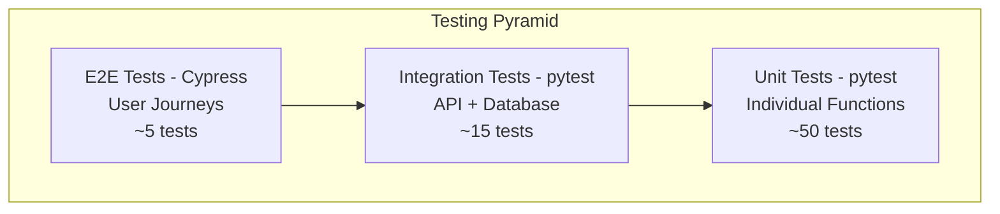
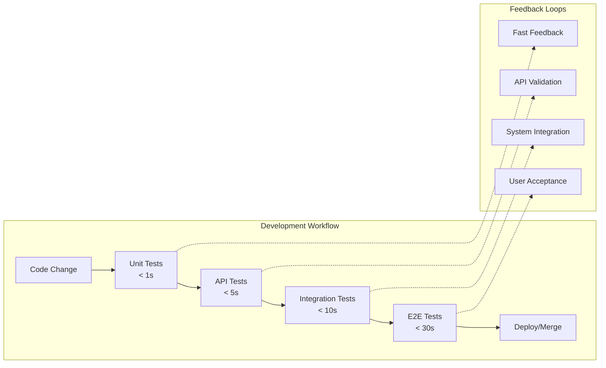
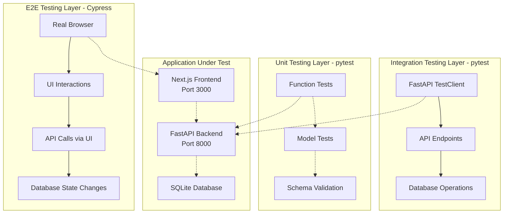
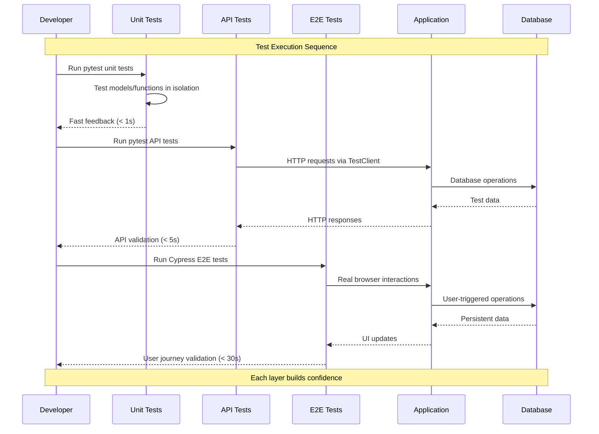
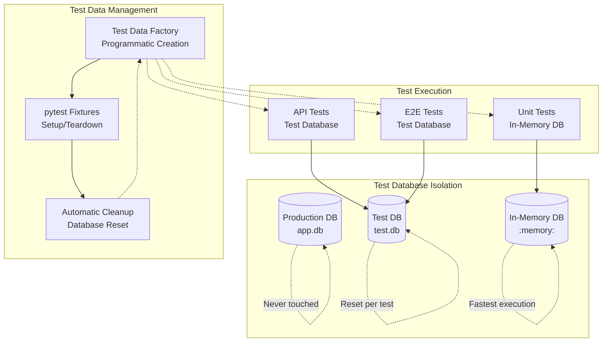
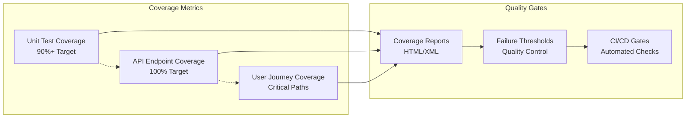

# Testing Architecture & System Design

This document provides a **testing-focused view** of the system architecture, emphasizing test layers, data flow, and framework integration patterns essential for Test Framework Engineering.

## 🧪 Testing Pyramid Architecture



## 🔄 Test Execution Flow



## 🏗️ Test Layer Architecture



## 🧩 Test Data Flow



## 🔧 Test Framework Configuration

```mermaid
graph LR
    subgraph "pytest Configuration"
        PYTEST_CFG[pytest.ini<br/>Test Discovery]
        FIXTURES[conftest.py<br/>Shared Fixtures]
        COV_CFG[.coveragerc<br/>Coverage Config]
        
        PYTEST_CFG -.-> FIXTURES
        FIXTURES -.-> COV_CFG
    end
    
    subgraph "Cypress Configuration"
        CY_CFG[cypress.config.ts<br/>Base Configuration]
        CY_SUPPORT[support/e2e.ts<br/>Global Setup]
        CY_COMMANDS[support/commands.ts<br/>Custom Commands]
        
        CY_CFG -.-> CY_SUPPORT
        CY_SUPPORT -.-> CY_COMMANDS
    end
    
    subgraph "CI/CD Pipeline"
        GITHUB[GitHub Actions<br/>(Ready)]
        REPORTS[Test Reports<br/>Coverage Analysis]
        ARTIFACTS[Test Artifacts<br/>Screenshots/Videos]
        
        GITHUB -.-> REPORTS
        REPORTS -.-> ARTIFACTS
    end
    
    PYTEST_CFG --> GITHUB
    CY_CFG --> GITHUB
```

## 📊 Test Database Strategy



## 🚀 Test Coverage Analysis



## 🎯 Testing Best Practices Demonstrated

### 1. **Test Isolation**
- Each test runs independently
- Fresh database state for every test
- No shared test data between tests

### 2. **Test Data Management**
- Programmatic test data creation
- Factory patterns for reusable test objects
- Automatic cleanup and teardown

### 3. **Framework Integration**
- pytest for backend testing with fixtures
- Cypress for frontend testing with custom commands
- Proper configuration for both frameworks

### 4. **Performance Optimization**
- Fast unit tests (< 1 second)
- Efficient database operations
- Parallel test execution ready

### 5. **CI/CD Readiness**
- Test reporting and artifacts
- Coverage analysis and gates
- Cross-platform compatibility

This architecture demonstrates a comprehensive understanding of modern testing strategies essential for Test Framework Engineering roles.
