# System Architecture

## High-Level Architecture

```mermaid
graph TB
    User[👤 User] --> Browser[🌐 Web Browser]
    Browser --> NextJS[📱 Next.js Frontend<br/>Port 3000]
    NextJS --> Proxy[🔄 API Proxy<br/>/api/*]
    Proxy --> FastAPI[⚡ FastAPI Backend<br/>Port 8000]
    FastAPI --> SQLAlchemy[🗃️ SQLAlchemy ORM]
    SQLAlchemy --> SQLite[💾 SQLite Database]
    
    NextJS --> Static[📄 Static Assets]
    FastAPI --> Pydantic[🔍 Pydantic Validation]
    
    style User fill:#e1f5fe
    style Browser fill:#f3e5f5
    style NextJS fill:#e8f5e8
    style FastAPI fill:#fff3e0
    style SQLite fill:#fce4ec
```

## Component Breakdown

### Frontend Layer (Next.js)
- **Framework**: Next.js 15 with App Router
- **Language**: TypeScript for type safety
- **Styling**: Tailwind CSS for responsive design
- **State Management**: React hooks for local state
- **API Communication**: Fetch API with proxy configuration

### Backend Layer (FastAPI)
- **Framework**: FastAPI for modern Python web development
- **ORM**: SQLAlchemy for database operations
- **Validation**: Pydantic for request/response models
- **Server**: Uvicorn ASGI server
- **Database**: SQLite for lightweight persistence

### Data Flow

## Key Architectural Decisions

### 1. API Proxy Configuration
- **Why**: Avoid CORS issues during development
- **How**: Next.js rewrites `/api/*` to `http://localhost:8000/api/*`
- **Benefit**: Seamless frontend-backend communication

### 2. Type Safety Across Stack
- **Frontend**: TypeScript interfaces for API responses
- **Backend**: Pydantic models for validation
- **Benefit**: Reduced runtime errors, better developer experience

### 3. Database Abstraction
- **ORM**: SQLAlchemy for database operations
- **Models**: Declarative Base with relationships
- **Benefit**: Database-agnostic code, easy migrations

## Infrastructure

```mermaid
graph LR
    Dev[👩‍💻 Development] --> Local[🏠 Local Environment]
    Local --> Frontend[Next.js:3000]
    Local --> Backend[FastAPI:8000]
    Local --> DB[SQLite File]
    
    Testing[🧪 Testing] --> Pytest[Backend Tests]
    Testing --> Cypress[E2E Tests]
    
    Production[🚀 Production] --> Deploy[Deployment Target]
    Deploy --> CDN[Static Assets]
    Deploy --> Server[API Server]
    Deploy --> Storage[Database]
```

## Scalability Considerations

### Current Architecture
- Single-server deployment
- SQLite for simple persistence
- File-based session storage

### Future Enhancements
- Load balancer for multiple instances
- PostgreSQL for production database
- Redis for session management
- CDN for static asset delivery
- Containerization with Docker
