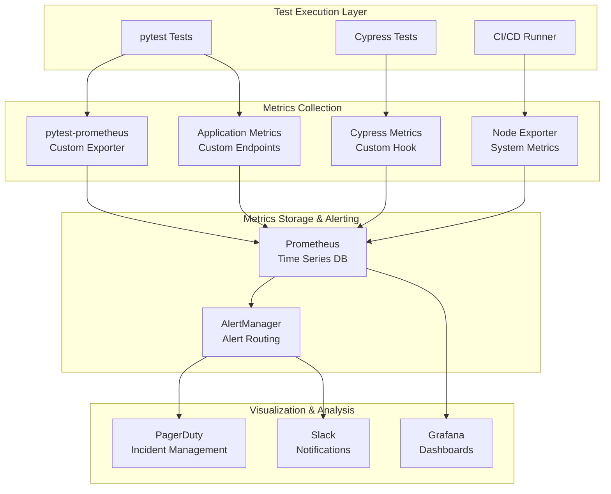

# Advanced Test Monitoring & Alerting Strategy

This document covers **advanced test framework engineering concepts** including monitoring, metrics collection, alerting, and observability for test infrastructure using Prometheus and Grafana.

## 🎯 Test Monitoring Philosophy

### Why Monitor Test Infrastructure?

- **Test Reliability**: Detect flaky tests and infrastructure issues before they impact development velocity
- **Performance Trends**: Track test execution times and resource usage to optimize efficiency
- **Quality Metrics**: Monitor test coverage, pass rates, and failure patterns to maintain quality standards
- **Capacity Planning**: Understand resource requirements and scaling needs for test infrastructure
- **SLA Compliance**: Ensure test execution meets service level agreements for development teams

## 📊 Test Metrics Architecture

## 🔍 Key Test Metrics Categories

### 1. Test Execution Metrics

**Purpose**: Monitor the performance and reliability of test execution across different environments and test types.

**Critical Metrics**:
- **Test Duration**: Track execution time trends to identify performance degradation
- **Test Pass Rate**: Monitor success rates to detect quality issues early
- **Test Suite Completion Time**: Ensure test execution meets CI/CD pipeline requirements
- **Test Retry Frequency**: Identify flaky tests that require investigation

**Business Impact**: Slow or unreliable tests directly impact developer productivity and release velocity.

### 2. Test Infrastructure Metrics

**Purpose**: Ensure test infrastructure can handle current load and plan for future capacity needs.

**Critical Metrics**:
- **Resource Utilization**: CPU, memory, and disk usage of test runners
- **Queue Metrics**: Test wait times and queue depths in CI/CD systems
- **Parallel Execution Efficiency**: How effectively tests utilize available resources
- **Environment Availability**: Uptime and health of test environments

**Business Impact**: Infrastructure bottlenecks can become development team blockers and increase infrastructure costs.

### 3. Test Quality Metrics

**Purpose**: Maintain and improve the overall quality and reliability of the test suite.

**Critical Metrics**:
- **Code Coverage Trends**: Track coverage changes over time to maintain quality standards
- **Flaky Test Detection**: Identify tests with inconsistent results that erode confidence
- **Test Maintenance Burden**: Time spent maintaining vs writing new tests
- **Test-to-Production Defect Ratio**: Effectiveness of test suite in catching bugs

**Business Impact**: Poor test quality leads to production bugs, reduced developer confidence, and increased maintenance overhead.

## 🏗️ Monitoring Strategy & Architecture

### Monitoring System Components

**Prometheus (Metrics Collection)**:
- Time-series database designed for reliability and scalability
- Pull-based model that scrapes metrics from test runners and applications
- Powerful query language (PromQL) for aggregating and analyzing test data
- Built-in service discovery for dynamic test environments

**Grafana (Visualization)**:
- Creates dashboards for different stakeholders (developers, QA, operations)
- Provides alerting capabilities with multiple notification channels
- Supports drill-down functionality for investigating test failures
- Enables sharing of insights across teams

**AlertManager (Alert Routing)**:
- Handles alert deduplication and grouping to reduce noise
- Routes alerts to appropriate teams based on severity and type
- Manages alert escalation policies and schedules
- Integrates with incident management tools (PagerDuty, Slack, email)

### Data Collection Strategies

**Push vs Pull Models**:
- **Pull Model**: Prometheus scrapes metrics from test runners (preferred for persistent services)
- **Push Model**: Test jobs push metrics to Pushgateway (better for short-lived CI jobs)
- **Hybrid Approach**: Use both models depending on test execution context

**Metric Labeling Strategy**:
- **Environment Labels**: Distinguish between test, staging, production environments
- **Test Type Labels**: Categorize unit, integration, e2e tests for different SLAs
- **Team Labels**: Enable team-specific alerting and dashboard filtering
- **Version Labels**: Track test performance across application versions

### Dashboard Design Philosophy

**Hierarchy of Information**:
- **Executive View**: High-level KPIs, trend analysis, SLA compliance
- **Team View**: Test suite health, coverage trends, failure analysis
- **Developer View**: Individual test performance, flaky test identification
- **Operations View**: Infrastructure utilization, capacity planning

**Real-Time vs Historical Analysis**:
- **Real-Time Dashboards**: Current test execution status, active alerts
- **Historical Dashboards**: Trend analysis, performance regression detection
- **Comparative Dashboards**: Week-over-week, release-over-release comparisons

## 📈 Alert Strategy & Design

### Alert Classification System

**Severity Levels**:
- **Critical**: Test infrastructure down, blocking all development
- **Warning**: Performance degradation, flaky tests detected
- **Info**: Trend notifications, capacity planning alerts

**Alert Categories**:
- **Reliability Alerts**: Test failures, infrastructure issues
- **Performance Alerts**: Slow execution, resource exhaustion
- **Quality Alerts**: Coverage drops, flaky test increases
- **Capacity Alerts**: Queue buildup, resource utilization

### Alert Design Principles

**Actionability**: Every alert should have a clear action path
- Include runbook links for common issues
- Provide context about affected systems or teams
- Suggest immediate remediation steps

**Noise Reduction**: Prevent alert fatigue through intelligent filtering
- Use alert grouping to consolidate related issues
- Implement smart thresholds that adapt to historical patterns
- Suppress alerts during known maintenance windows

**Escalation Strategy**: Ensure critical issues get attention
- Time-based escalation for unacknowledged alerts
- Team-based routing for specialized knowledge
- Integration with incident management systems

### Alert Threshold Strategies

**Static Thresholds**: Fixed values based on SLA requirements
- Example: Test suite execution time > 15 minutes
- Best for: Well-understood metrics with clear business requirements

**Dynamic Thresholds**: Adaptive based on historical patterns
- Example: Test failure rate > 3 standard deviations from 7-day average
- Best for: Metrics with natural variation or seasonal patterns

**Anomaly Detection**: Machine learning-based threshold detection
- Identifies unusual patterns in test behavior
- Reduces false positives from normal variation
- Requires sufficient historical data for training

## 🚨 Common Alert Scenarios & Response

### High Test Failure Rate

**Scenario**: Test pass rate drops below acceptable threshold

**Investigation Process**:
1. Identify affected test suites and environments
2. Check for recent code changes or deployments
3. Review infrastructure metrics for resource issues
4. Analyze test logs for common failure patterns

**Response Actions**:
- Immediate: Notify development teams of affected areas
- Short-term: Rollback recent changes if identified as root cause
- Long-term: Improve test reliability and failure detection

### Slow Test Execution

**Scenario**: Test execution time exceeds SLA requirements

**Investigation Process**:
1. Identify which tests or test suites are slow
2. Check resource utilization on test runners
3. Analyze database performance and test data volume
4. Review parallelization effectiveness

**Response Actions**:
- Immediate: Scale test infrastructure if resource-bound
- Short-term: Optimize slow tests or test setup/teardown
- Long-term: Improve test architecture and data management

### Flaky Test Detection

**Scenario**: Tests showing inconsistent results across runs

**Investigation Process**:
1. Identify patterns in test failures (timing, environment, dependencies)
2. Review test isolation and data cleanup
3. Check for race conditions or external dependencies
4. Analyze infrastructure stability during test execution

**Response Actions**:
- Immediate: Quarantine consistently flaky tests
- Short-term: Fix identified issues and improve test reliability
- Long-term: Implement better test design patterns

## 🔧 Advanced Monitoring Concepts

### Test Environment Health Monitoring

**Purpose**: Ensure test environments are available and performing optimally

**Key Strategies**:
- **Synthetic Monitoring**: Automated health checks that run continuously
- **Dependency Tracking**: Monitor external services that tests rely on
- **Environment Isolation**: Detect when test environments affect each other
- **Resource Monitoring**: Track CPU, memory, disk, and network utilization

**Implementation Considerations**:
- Health checks should mimic actual test patterns
- Monitor both application services and supporting infrastructure
- Alert on both availability and performance degradation
- Include database health and test data integrity

### Test Data Quality Monitoring

**Purpose**: Ensure test data remains consistent and reliable over time

**Key Strategies**:
- **Data Integrity Checks**: Validate referential integrity in test databases
- **Data Freshness**: Monitor when test data was last updated or refreshed
- **Data Volume**: Track test data growth and cleanup effectiveness
- **Schema Changes**: Detect when database schema changes affect tests

**Implementation Considerations**:
- Regular data quality scans during off-peak hours
- Automated test data refresh and cleanup processes
- Version control for test data schemas and fixtures
- Monitoring of data anonymization and privacy compliance

### Trend Analysis & Predictive Monitoring

**Purpose**: Identify patterns and predict future issues before they impact teams

**Key Strategies**:
- **Performance Trend Analysis**: Track test execution time changes over releases
- **Resource Usage Forecasting**: Predict when infrastructure scaling is needed
- **Quality Trend Monitoring**: Identify gradual degradation in test reliability
- **Capacity Planning**: Model future test infrastructure requirements

**Implementation Considerations**:
- Use statistical methods to identify significant trends
- Consider seasonal patterns in development cycles
- Implement automated recommendations for optimization
- Balance historical data retention with storage costs

## 📋 Monitoring Implementation Checklist

### Phase 1: Basic Monitoring
- [ ] Implement test execution metrics collection
- [ ] Set up Prometheus server and basic configuration
- [ ] Create fundamental Grafana dashboards
- [ ] Configure basic alerting for test failures

### Phase 2: Advanced Metrics
- [ ] Add test infrastructure resource monitoring
- [ ] Implement flaky test detection algorithms
- [ ] Set up test data quality monitoring
- [ ] Configure environment health checks

### Phase 3: Intelligent Alerting
- [ ] Implement dynamic alerting thresholds
- [ ] Set up alert escalation policies
- [ ] Configure alert fatigue reduction
- [ ] Implement incident response automation

### Phase 4: Predictive Analytics
- [ ] Add capacity planning metrics
- [ ] Implement test execution forecasting
- [ ] Set up anomaly detection
- [ ] Configure proactive alerting

## 🎯 Best Practices for Test Monitoring

### 1. **Metrics Design Principles**
- **Actionable**: Each metric should lead to specific actions
- **Relevant**: Focus on metrics that impact test quality and reliability
- **Timely**: Provide real-time feedback when possible
- **Contextual**: Include relevant labels for filtering and grouping

### 2. **Alert Design Guidelines**
- **Meaningful**: Alerts should indicate real problems
- **Actionable**: Recipients should know how to respond
- **Tuned**: Reduce false positives through proper thresholds
- **Escalated**: Critical issues should have escalation paths

### 3. **Dashboard Design**
- **Role-based**: Different views for different stakeholders
- **Hierarchical**: From high-level KPIs to detailed metrics
- **Interactive**: Allow drilling down into specific issues
- **Contextual**: Provide relevant timeframes and comparisons

This advanced monitoring strategy demonstrates sophisticated understanding of test infrastructure observability and operational excellence - key skills for senior Test Framework Engineering positions.
